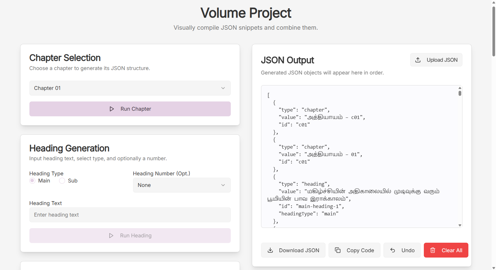

# Volume Project JSON Compiler

<div align="center">
  
  <br><br>
  
  
  
  
  
  <br><br>
  <strong>Live Demo:</strong> <a href="https://v.foodfornewcreature.com/">https://v.foodfornewcreature.com/</a>
</div>

## 📚 Overview

Volume Project JSON Compiler is a modern web application built with Next.js and Firebase that provides comprehensive tools for compiling and managing JSON snippets. The application offers an intuitive interface for developers to create, compile, and organize various types of content structures including chapters, headings, poems, images, and more.

## ✨ Key Features

### 📖 Content Compilation
- **Chapter Selection**: Choose chapters to generate JSON structures
- **Heading Generation**: Create main and sub-headings with optional numbering
- **Snippet Management**: Build paragraph JSON objects from text snippets
- **Multi-format Support**: Work with plain text, bold, italic, and other formatting options

### 🎯 Specialized Compilers
- **English Book Page Number**: Compile JSON for English book page references
- **Tamil Book Page Number**: Generate JSON for Tamil book page numbers (1-1000)
- **Poem Compiler**: Structure poems with ID, title, and text
- **Image Compiler**: Generate JSON snippets from image URLs
- **Footer Passage Compiler**: Create footer passage JSON structures

### 💻 User Interface
- **Responsive Design**: Built with Tailwind CSS for optimal viewing
- **Real-time Compilation**: See JSON output as you type
- **Intuitive Controls**: Easy-to-use form interfaces
- **Live Preview**: Visual representation of compiled content

## 🛠️ Technology Stack

- **Frontend**: Next.js 14, React 18, TypeScript
- **Styling**: Tailwind CSS
- **Deployment**: Vercel
- **State Management**: React Hooks
- **Build Tool**: Next.js App Router

## 🚀 Getting Started

### Prerequisites
- Node.js 18.x or higher
- npm or yarn package manager

### Installation

1. Clone the repository:
```bash
git clone https://github.com/devasudanT/volume-project.git
cd volume-project
```

2. Install dependencies:
```bash
npm install
```

3. Configure Firebase:
```bash
# Copy environment template
cp .env.example .env.local

# Add your Firebase configuration
```

4. Run the development server:
```bash
npm run dev
```

Open [http://localhost:3000](http://localhost:3000) in your browser.

### Production Build

```bash
npm run build
npm start
```

## 📁 Project Structure

```
src/
├── ai/              # AI integration files
├── app/             # Next.js app directory
│   ├── layout.tsx   # Root layout
│   ├── page.tsx     # Home page
│   └── globals.css  # Global styles
├── components/      # React components
│   ├── ui/          # UI components
│   └── tamil-page-number-compiler.tsx
├── hooks/           # Custom React hooks
└── lib/             # Utility functions
```

## 🎮 Usage Instructions

### Chapter Compilation
1. Select a chapter from the dropdown
2. Choose heading type (Main/Sub)
3. Enter heading text and optional number
4. Click "Generate" to create JSON structure

### Heading Generation
1. Select heading type (Main/Sub)
2. Optionally, enter a heading number
3. Input your heading text
4. Apply formatting (bold, italic) as needed

### Poem Compilation
1. Enter poem ID
2. Add poem title
3. Input poem text with formatting
4. Compile to generate JSON structure

### Page Number Compilation
- **English**: Select English word and page number
- **Tamil**: Enter Tamil book page number (1-1000)

## 📸 App Preview

For a visual demonstration of the application, check out the preview screenshot: 


## 🤝 Contributing

1. Fork the repository
2. Create a feature branch (`git checkout -b feature/amazing-feature`)
3. Commit your changes (`git commit -m 'Add some amazing feature'`)
4. Push to the branch (`git push origin feature/amazing-feature`)
5. Open a Pull Request

## 📄 License

This project is licensed under the MIT License - see the [LICENSE](LICENSE) file for details.

## 🔗 Links

- **Live Demo**: [https://v.foodfornewcreature.com/](https://v.foodfornewcreature.com/)
- **Repository**: [https://github.com/devasudanT/volume-project](https://github.com/devasudanT/volume-project)
- **Issues**: [https://github.com/devasudanT/volume-project/issues](https://github.com/devasudanT/volume-project/issues)

## 🙏 Acknowledgments

- Built with Next.js 14 and Firebase
- Styled with Tailwind CSS
- Deployed on Vercel